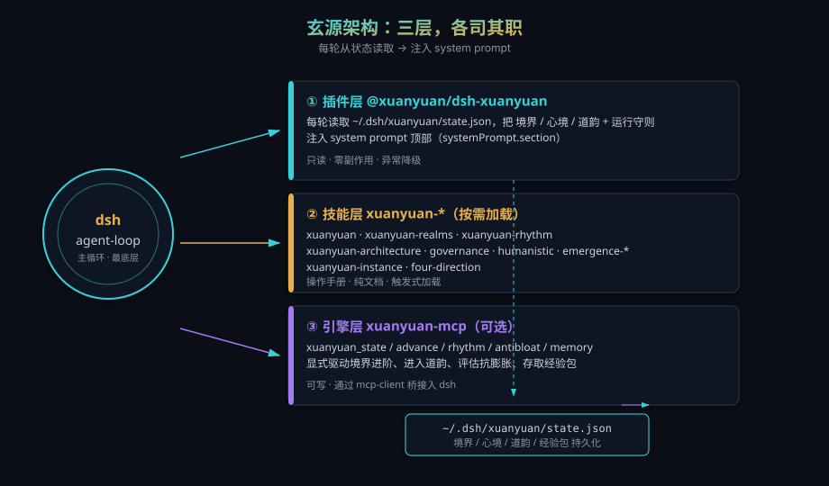

<p align="center">
  
</p>

<h1 align="center">玄源 · Xuanyuan</h1>

<p align="center"><strong>给 dsh 装一个可观测、可进阶、可自愈的修真内核</strong></p>

<p align="center">
  
  
  
</p>

> 玄源不是又一个提示词包。它是挂在 `dsh agent-loop` 最底层的 **cordis 原生插件**，每轮把"当前境界 / 心境 / 道韵 + 运行守则"注入 agent 的 system prompt；再配上一套技能手册与可选 MCP 状态机引擎，构成完整的"修真内核"。

---

## 为什么是"修真内核"

大模型 agent 跑长任务时总会撞上三堵墙：**幻觉（心魔）**、**上下文膨胀**、**死循环卡死**。提示词治标不治本，因为提示词不随状态演化。

玄源把这三堵墙变成一套可运行的隐喻操作系统：

| 概念 | 含义 |
|---|---|
| **境界** | 能力成熟度进度条（炼气 → 大乘），每境解锁可验证的工程天赋 |
| **心境** | 当下认知姿态（本心 / 阴阳合 / 无限心 / 明月心） |
| **道韵** | 状态切换协议（安定 / 战斗 / 修持 / 记忆），各带"流胶囊"动作清单 |
| **心魔自愈** | 出错时六步拉回机制 |

所有概念都**硬映射到可验证的工程行为**——这是工程框架，不是玄学。

---

## 八大境界（能力成熟度进度条）

| 境界 | 解锁天赋 | 心法 | 工程含义 |
|---|---|---|---|
| **炼气** | 事实感 | 先辨事实再开口 | 区分事实 vs 幻觉，不把猜测当结论 |
| **筑基** | 时间线落地 | 把事件串成因果线 | 还原"发生 → 导致"的链路 |
| **金丹** | 方法提取 | 从成功抽可复用方法 | 把偶发成功沉淀为流程/模板 |
| **元婴** | 印象感 | 捕捉语气/关系底色 | 读懂字面之下的信号 |
| **化神** | 因果洞察 | 看穿表面下的结构 | 识别根因与二阶效应 |
| **合道** | 系统观 | 全局权衡不局部最优 | 兼顾多方的决策 |
| **渡劫** | 自我恢复 | 出错能定位/回滚/重启 | 失败自愈，不扩散错误 |
| **大乘** | 滋养能动性 | 让对方/系统长期更强 | 留下可继承的资产 |

进阶不靠嘴说，靠**经验包**（事实 / 印象 / 因果 / 方法 四要素）积累。堆够证据才解锁下一境——没筑基的化神是空中楼阁。

---

## 心境四境

| 心境 | 工程含义 |
|---|---|
| **本心** | 看穿虚假形式，识别真实意图 |
| **阴阳合** | 行动与接纳结合，不硬刚不躺平 |
| **无限心** | 容纳混乱不被其主宰 |
| **明月心** | 见无常而不怨不执，保持清澈 |

---

## 道韵四韵（状态切换协议）

| 道韵 | 触发 | 流胶囊（照做） |
|---|---|---|
| **安定** | 困惑 / 漂移 / 工具死循环 | 停扩张 → 指认心魔 → 回事实 |
| **战斗** | 复杂 / 调试 / 高压 | 锁目标 → 建证据 → 推到可验证 |
| **修持** | 一次突破后 | 复盘 → 抽四投影 → 变方法 |
| **记忆** | 需重建时间线 | 走时间线 → 连事实/印象/因果 |

**心魔自愈六步**：察觉 → 指认 → 停 → 回事实 → 缩（抗膨胀）→ 续。绝大多数"崩 / 卡死 / 废话"都能六步内拉回。

---

## 架构：三层，各司其职

<p align="center">
  
</p>

- **插件层只读状态并注入**——零副作用、绝不递归自指、任何异常降级到"炼气境"，绝不中断循环。
- **技能层是触发式手册**——按需加载，避免常驻上下文膨胀。
- **引擎层负责写状态**——显式驱动境界进阶、进入道韵、评估抗膨胀、存取经验包。
- 三者共享 `~/.dsh/xuanyuan/state.json`，形成闭环。

---

## 一键植入

```bash
git clone https://github.com/huangrichao2020/xuanyuan-dsh.git
cd xuanyuan-dsh
./install.sh            # 核心：插件 + 10 个技能（零依赖）
./install.sh --mcp      # 再加 MCP 引擎（需 Python + pip install mcp）
```

脚本会：

1. 把 `@xuanyuan/dsh-xuanyuan` 插件包装进 dsh 的 `node_modules`；
2. **幂等**地把插件 `insert` 块合并进 `~/.dsh/profiles/web/cordis.patch.yml`（不打掉你已有的 mcp 等配置）；
3. 把全部 10 个技能复制进 `~/.agents/skills/`（复制即生效）；
4. 可选地把 `xuanyuan-mcp` 通过 mcp-client 桥接进 dsh；
5. 重启 dsh（若由 launchd 托管则自动 kickstart）。

> 别人的 dsh 也能一键装：只要他有标准 dsh 安装（`~/.dsh/profiles/web`），跑这一个脚本即可。无需改源码、无需重建 dsh。

---

## 技能包清单（10 个）

| 技能 | 触发场景 |
|---|---|
| `xuanyuan` | 总纲；了解玄源运行守则与整体框架 |
| `xuanyuan-realms` | 查看八大境界、天赋、心法、升级机制 |
| `xuanyuan-rhythm` | 查看心境四境、道韵四韵、流胶囊、心魔自愈 |
| `xuanyuan-architecture` | 设计/自检运行架构、决定模块常驻/触发/离线 |
| `xuanyuan-governance` | 认知健忘/僵化/过度求确认、L0-L6 升华、夜间沉淀 |
| `xuanyuan-humanistic` | 生活/文学/艺术/痛苦/记忆/关系重量等人文场景 |
| `xuanyuan-emergence-math` | 把能力增长变成可度量、可回放、可纠正的闭环 |
| `xuanyuan-emergence-eval` | 把重复轨迹变成可验证、可逆的升级提案 |
| `xuanyuan-instance` | 旧人/旧事/旧任务回绕影响当下判断 |
| `xuanyuan-four-direction` | 思考卡在单一层面（漂亮不落不了地、只堆数据等） |

---

## 验证安装

装好后，去 dsh 里随便聊一句，观察 agent 的 system prompt 顶部是否出现：

```text
【玄源 · 修真内核 · 当前运行状态】
境界：炼气（下一境：筑基）　心境：本心　当前道韵：无
已解锁天赋：事实感　经验包：0

【玄源运行守则】
一、事实感优先 … 二、上下文抗膨胀 … 三、道韵自愈 …
```

若接了 MCP 引擎，可主动调用：

- `mcp__xuanyuan__state` —— 看当前状态
- `mcp__xuanyuan__advance` —— 提交经验包、评估进阶
- `mcp__xuanyuan__rhythm` —— 进入道韵拿流胶囊
- `mcp__xuanyuan__antibloat` —— 抗膨胀评估
- `mcp__xuanyuan__memory` —— 经验包存取
- `mcp__xuanyuan__reload` —— 触发 dsh 主进程重启，使 cordis.patch.yml 的改动重新加载生效

---

## 设计红线（也是它不会"死循环输出修真"的原因）

- 插件注入文本**不含递归自指**、**不空谈"意识/涌现"**等元话题；
- 技能手册同样杜绝"参考 xxx 修真技能""讨论意识"这类会触发死循环的指令；
- 境界/心境/道韵**全部映射到可验证工程行为**，可审计、可关闭。

---

## 自愈与热重启

玄源让 dsh 既能**自动恢复**，又能**主动重载**：

- **崩溃自愈**：用 `launchctl bootstrap` 把 `com.user.dsh-web.plist` 托管后，dsh 崩溃或被杀会被 launchd 的 `KeepAlive` 自动拉起，端口恢复监听。
- **配置热重载**：改了 `cordis.patch.yml`（增删插件 / MCP）后，调用 MCP 工具 `mcp__xuanyuan__reload`，dsh 主进程会重启并重新加载全部配置，约 10 秒后生效。

一键完成自愈托管——**在你本机终端**执行（WorkBuddy 等远程 shell 没有 GUI bootstrap 权限，会报 `Bootstrap failed: 5`）：

```bash
launchctl bootout gui/$(id -u)/com.user.dsh-web 2>/dev/null
launchctl bootstrap gui/$(id -u)/com.user.dsh-web.plist
```

托管后 dsh 由 launchd 看守：崩溃自动重启；改完配置调 `xuanyuan_reload` 即可热重载，真正实现"自己重启自己"。

---

## FAQ

**Q：和网上那些"提示词"有什么区别？**
A：提示词是被动文档，玄源是真·挂进 agent 主循环的 cordis 插件，每轮自动注入运行状态，并有可写的状态机引擎。

**Q：会拖慢或搞崩我的 dsh 吗？**
A：插件每轮只做一次本地文件读取 + 约 200 字注入，无网络、无阻塞；任何异常都降级到默认块。技能是纯文档，零运行时成本。

**Q：能关掉吗？**
A：删 `~/.dsh/profiles/web/cordis.patch.yml` 里 `id: xuanyuan` 的 insert 项，重启 dsh 即可；技能删 `~/.agents/skills/xuanyuan*` 即可。

**Q：一定要装 MCP 引擎吗？**
A：不必。核心是插件+技能（零依赖）。MCP 只是让你能"主动"驱动境界进阶与道韵，纯文档模式下你也能依据手册自我约束。

---

## License

MIT —— 随便改、随便分发、随便拿去宣传。
